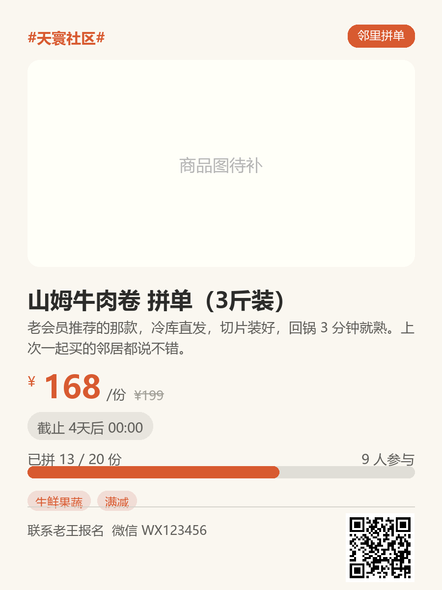

# 邻里圈 · 社群运营工作台

[](https://github.com/lieyan886/neighbor-hub/actions/workflows/ci.yml)
[](LICENSE)
[](https://github.com/lieyan886/neighbor-hub/releases/latest)

给小区群主 / 团长用的桌面工具：**采集 → 管理 → 出图 → 发群**，一条流水线搞定社区活动、邻里拼单、周边优惠和羊毛信息的日常运营。

居民不用装任何东西——你在桌面上干活，产出的是微信群友好的卡片图和接龙文案。



## 快速开始

```powershell
cd community-hub
python -m venv .venv
.\.venv\Scripts\python.exe -m pip install -r requirements.txt
.\.venv\Scripts\python.exe app.py            # 启动界面
.\.venv\Scripts\python.exe app.py --selftest # 全链路自检（不出界面）
```

依赖：PySide6 / httpx / Pillow / APScheduler / openpyxl / matplotlib / qrcode，Python 3.10+。

**打包成 exe**（给别人用时不必装 Python）：

```powershell
.\.venv\Scripts\python.exe -m pip install -r requirements-dev.txt
.\.venv\Scripts\python.exe tools\build_exe.py     # 产物 dist\邻里圈\邻里圈.exe
```

整个 `dist\邻里圈\` 目录拷走即可双击运行，约 190 MB。

## 五大模块

| 模块 | 干什么 | 关键能力 |
|---|---|---|
| ① 信息采集台 | 把外部信息变成草稿 | 粘链接自动抓标题/价格/头图/截止时间；整段粘贴清单自动切分；Excel 导入；黑白名单 + 指纹去重 |
| ② 内容管理台 | 三类内容统一管理 | 社区活动 / 邻里拼单 / 周边优惠；生命周期自动流转（草稿→进行中→即将截止→已过期）；群接龙文本粘贴回解析、同名自动累加；截止前桌面通知 |
| ③ 分发生成器 | 触达居民 | Pillow 渲染 900×1200 分享卡片（封面/价格/进度条/二维码），多模板可配色；**一键推群**：公告文案进剪贴板 + 卡片出图 + 记录分发一次做完 |
| ④ 数据看板 | 复盘 | 发布趋势、类型占比、拼单完成度、热度排行；导出内容总表 / 报名明细 / 提货清单 xlsx |
| ⑤ 自动盯梢 | 后台替你盯页面 | 常看的团购/拼单链接存进监控源，每隔几小时自动重抓，**价格 / 截止 / 标题一变就桌面通知**；可选自动入库同步更新 |

## 核心工作流（一次拼单的完整闭环）

1. 采集台粘商品链接 → 自动抓出价格、头图、截止时间，入库
2. 管理台把状态改为「进行中」，生成器出卡片图 + 接龙文案 → 粘到微信群
3. 邻居在群里接龙 → 全选复制 → 管理台「粘贴接龙」→ 自动解析成报名记录、进度条更新
4. 快到期时弹窗提醒 → 到货后导出提货清单挨个核对

## 技术结构

```
community-hub/
├── app.py               # 入口（--selftest 自检）
├── core/                # 配置、SQLite、模型、仓储、APScheduler 提醒
├── collectors/          # 链接抓取解析、批量导入、过滤去重
├── render/              # 卡片渲染（Pillow）、文案生成与接龙回解析
├── exports/             # Excel 导出
├── ui/                  # PySide6 界面（深色主题）
├── tools/selftest.py    # 12 项全链路自检
└── data/                # 运行时数据（community.db + 封面缓存），整目录拷走即备份
```

## 设计原则

- **工具不碰钱**：收款走微信群收款或线下，工具只记「谁要了几份、结清没有」。
- **单机优先**：所有数据在本地 SQLite（WAL 模式），联网仅用于抓取。
- **二期规划**：接入微信群机器人（Napcat / 企微机器人），工具直接发群、回收接龙，替代手动粘贴。

## 对外脱敏

库里存真值，出口才打码 —— 自己核对名单看得到完整信息，发群和外发文件自动收敛。
设置里的「对外脱敏」三档：

| 档位 | 群文案 / 卡片 | Excel 导出 |
|---|---|---|
| 不脱敏 | 原样 | 原样 |
| **标准（默认）** | 手机号 138\*\*\*\*5678、门牌 3栋\*\*\*、身份证/邮箱遮罩；昵称保留（群里本来就是公开身份），自提点只留楼栋 | 姓名部分打码（张\*、王\*明），联系方式遮罩 |
| 严格 | 姓名化名（邻居1 / 邻居2） | 姓名部分打码，联系方式直接写「已隐藏」 |

覆盖的出口：群公告 / 接龙文案 / 今日汇总（`render/copywriter.py`）、
报名明细与提货清单（`exports/excel.py`）。覆盖范围由 `core/privacy.py` 统一管。

**两个手工注意点**：
1. 设置里的「小区名称」会印在卡片和文案上，对外分发建议填中性别名，别填真实小区全名。
2. 「联系方式」是你自己的号，印在卡片上不会被遮罩；不想公开就留空。

## 提醒与自动化

设置里可配置扫描间隔（15 分钟～2 小时）和提醒窗口（截止前 N 小时）。
后台定时器会自动把到期条目推进到「即将截止 / 已过期」。

**v1.2.0 起可以从「主动操作」切到「被动收通知」：**

1. **系统托盘 + 桌面通知**：截止提醒改成 Windows 气泡通知，不再打断当前操作；
   点通知直接跳到内容管理台，点托盘图标随时唤出主界面。
2. **缩到后台常驻**：点关闭按钮默认缩到托盘，程序继续定时扫描。
   要彻底退出就用托盘右键菜单里的「退出」。
3. **自动盯梢**：监控源页面变了才提醒，没变化不打扰（用内容指纹去重，
   广告位重排这类无关改动不会误报）。

## 采集的两级策略

1. **httpx 直取**（默认）：快，覆盖服务端直出的页面——大部分活动页、公众号推文、什么值得买。
2. **浏览器兜底**：标题或价格没拿到时，用 Playwright 开真实浏览器把 JS 跑完再解析，
   覆盖淘宝 / 拼多多 / 美团这类前端渲染页。代价是每条慢几秒，可在设置里关掉。

```powershell
.\.venv\Scripts\python.exe -m pip install playwright
.\.venv\Scripts\python.exe -m playwright install chromium
```

没装 Playwright 时这一级自动跳过，不影响其它功能；打包版不带浏览器内核，同样自动降级。

## 开发与测试

```powershell
.\.venv\Scripts\python.exe -m pip install -r requirements-dev.txt
.\.venv\Scripts\python.exe -m pytest                  # 20 条用例
.\.venv\Scripts\python.exe -m pytest -m browser       # 额外 1 条：拉真实浏览器渲染
.\.venv\Scripts\python.exe app.py --selftest          # 全链路自检（14 项，含浏览器兜底）
```

测试全程 `QT_QPA_PLATFORM=offscreen`，数据目录重定向到临时目录，不碰真实数据。
CI（GitHub Actions）在 Windows + Linux 双平台、Python 3.11 / 3.13 四组环境下跑同一套。

> 浏览器那条用例默认不跑（慢，且需要 Playwright）。它在本机 pytest 进程内会挂死——
> 这是 Playwright sync API 与 pytest 的已知冲突，已用最小用例复现，与本项目代码无关，
> 所以浏览器链路的验证放在 `app.py --selftest` 里。

## 版本记录

版本号定义在 `core/config.py` 的 `APP_VERSION`，主窗口标题、侧边栏底部、exe 文件属性都读它。

| 版本 | 日期 | 变化 |
|---|---|---|
| **v1.2.0** | 2026-10-02 | 后台常驻：系统托盘 + 桌面通知、关闭缩到托盘；**自动盯梢**（监控源定时重抓，价格/截止/标题变化才通知，数据库 `watch_sources` 表 + schema v2 迁移）；**一键推群**（文案进剪贴板 + 出图 + 记录分发一步完成）；pytest 增至 28 条、自检 17 项全通过 |
| v1.1.0 | 2026-10-01 | 打包为独立 exe（PyInstaller + 应用图标）；采集接 Playwright 渲染兜底；pytest 20 条用例 + GitHub Actions CI；补充 MIT LICENSE |
| v1.0 | 2026-10-01 | 首个可用版本：采集 / 管理 / 分发 / 看板四模块，SQLite + PySide6 |

每个版本在 [Releases](https://github.com/lieyan886/neighbor-hub/releases) 都附带打包好的 exe，不想装 Python 直接下那个就行。
